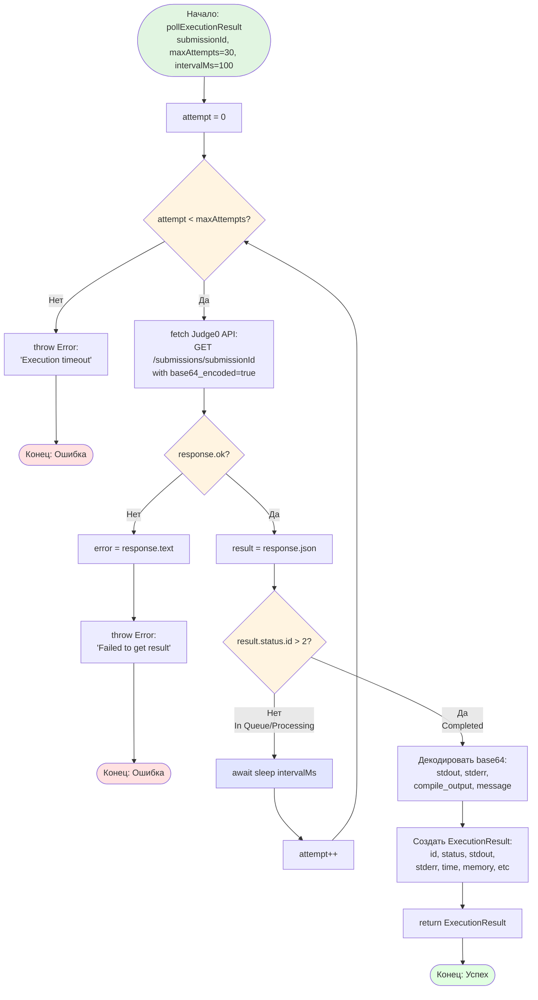

# Блок-схема: Polling Execution Result Algorithm

## Описание алгоритма

**Назначение:** Опрос Judge0 API до завершения выполнения кода

**Принцип работы:**
1. Цикл с максимум 30 попытками
2. На каждой итерации делает GET запрос к Judge0 API
3. Проверяет статус выполнения:
   - `status.id <= 2` (In Queue/Processing) → ждет 100ms и повторяет
   - `status.id > 2` (Completed/Error) → декодирует результат и возвращает
4. Если превышен лимит попыток → выбрасывает timeout ошибку

**Параметры:**
- `maxAttempts = 30` (максимум попыток)
- `intervalMs = 100` (интервал между попытками)
- Максимальное время ожидания: 30 × 100ms = 3 секунды

**Статусы Judge0:**
- `1` = In Queue
- `2` = Processing  
- `3` = Accepted
- `4+` = Error states (Wrong Answer, Compilation Error, etc.)

**Оптимизация:**
- Использует `base64_encoded=true` для корректной передачи UTF-8
- Запрашивает только нужные поля через `fields` параметр
- Декодирует base64 через `decodeMaybeBase64` с fallback
