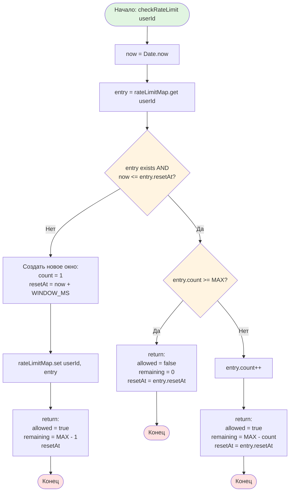

# Блок-схема: Rate Limiting Algorithm



## Описание алгоритма

**Назначение:** Ограничение частоты запросов пользователя (10 запросов в минуту)

**Принцип работы:**
1. Проверяет текущее время и ищет запись пользователя в Map
2. Если записи нет или окно истекло → создает новое окно (count=1)
3. Если окно активно и лимит достигнут → отклоняет запрос
4. Если окно активно и лимит не достигнут → инкрементирует счетчик

**Константы:**
- `RATE_LIMIT_WINDOW_MS = 60000` (1 минута)
- `MAX_REQUESTS_PER_WINDOW = 10`

**Структура данных:**
```typescript
interface RateLimitEntry {
  count: number;      // текущее количество запросов
  resetAt: number;    // timestamp сброса окна
}
```
